# ☁️ AWS Cloud Studies

---

## 🔹 Sobre

Este repositório reúne meus estudos e anotações sobre **Amazon Web Services (AWS)**.  
O objetivo é manter um **guia de estudo organizado**, registrar meu aprendizado contínuo e também servir como **portfólio de Cloud Computing**.

Inclui conceitos, exemplos, boas práticas e documentação dos serviços estudados.

---

## 📚 Conteúdos

Explore os serviços estudados. Cada serviço possui seu próprio `README.md` com explicações organizadas:

| Serviço | Descrição | Link |
|-------|-----------|------|
| **EC2** | Instâncias virtuais, AMIs e Security Groups | [Acessar](./aws-services/EC2/README.md) |
| **EC2 Auto Scaling** | Escalabilidade automática e alta disponibilidade | [Acessar](./aws-services/EC2AUTOSCALING/README.md) |
| **VPC** | Redes privadas, subnets, gateways e roteamento | [Acessar](./aws-services/VPC/README.md) |
| **VPC Peering** | Comunicação privada entre VPCs | [Acessar](./aws-services/VPC/PEERING/README.md) |
| **RDS** | Banco de dados relacional gerenciado | [Acessar](./aws-services/RDS/README.md) |
| **DYNAMODB** | Banco de dados NoSQL serverless | [Acessar](./aws-services/DYNAMODB/README.md) |
| **IAM** | Usuários, grupos, políticas e permissões | [Acessar](./aws-services/IAM/README.md) |
| **IAM Security** | Boas práticas e conceitos de segurança | [Acessar](./aws-services/IAMSECURITY/README.md) |
| **S3** | Armazenamento de objetos | [Acessar](./aws-services/S3/README.md) |
| **EFS** | Sistema de arquivos na nuvem | [Acessar](./aws-services/EFS/README.md) |
| **AZs** | Aplicações Web de Alta Disponibilidade | [Acessar](./aws-services/AZS/README.md) |

---

## 🎓 Certificados

| Evidências |
|-----------|
| 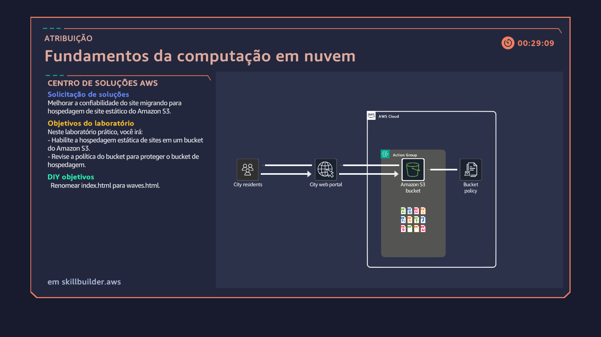 |
| 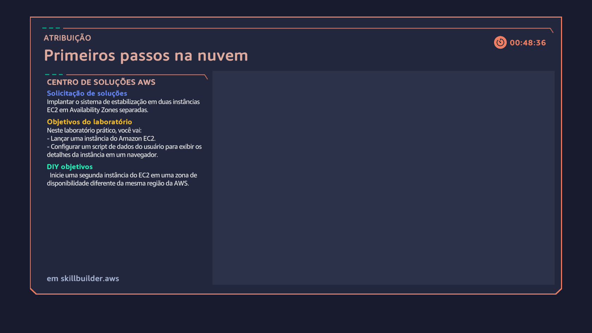 |
| 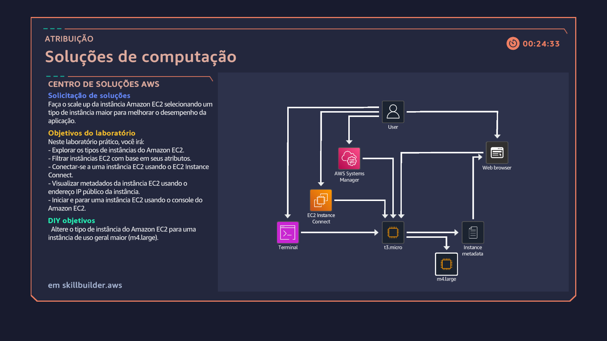 |
| 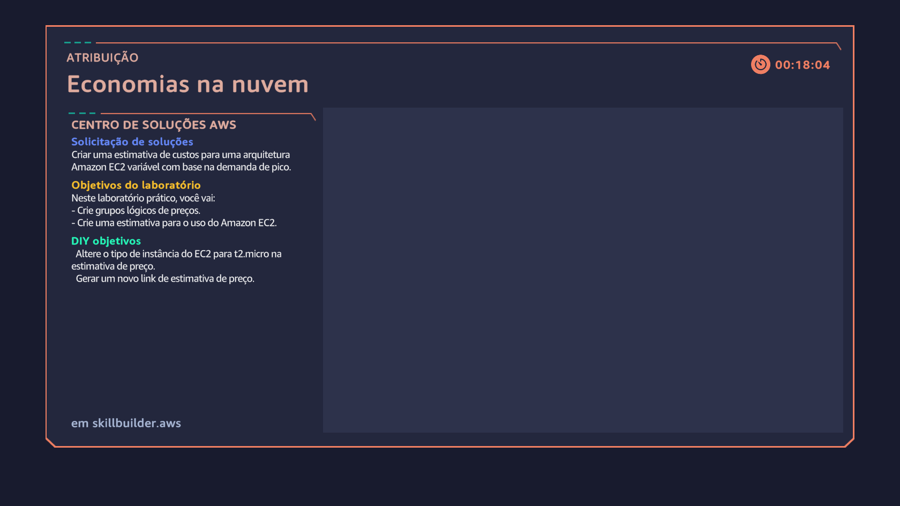 |
| 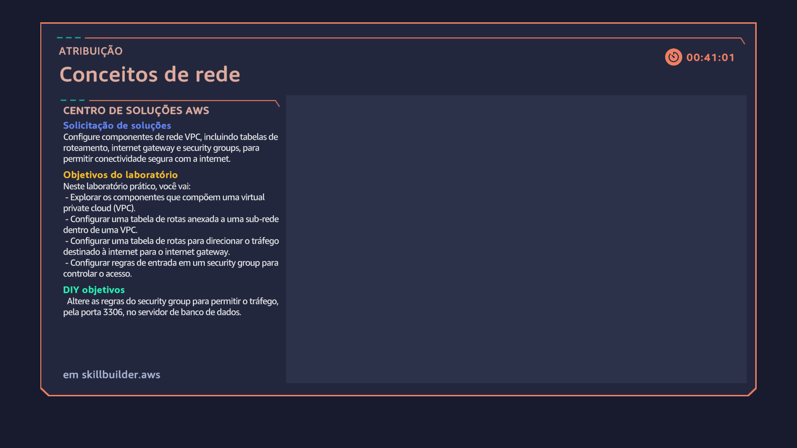 |
| 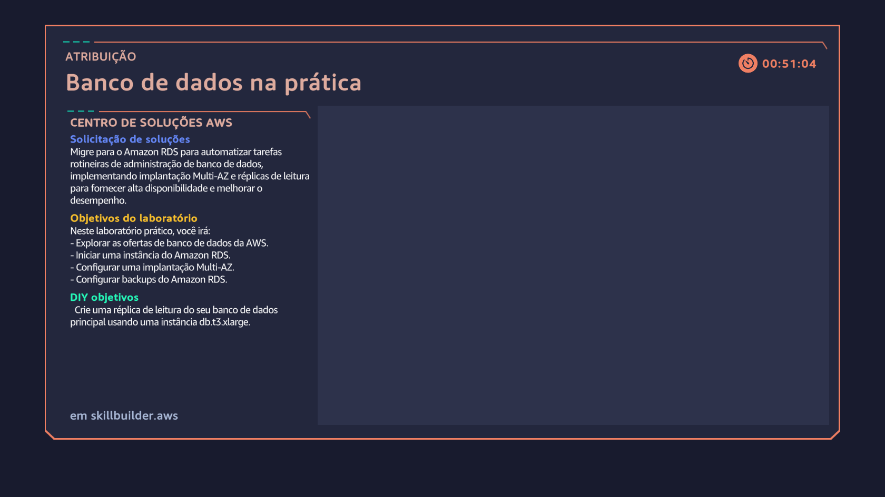 |
| 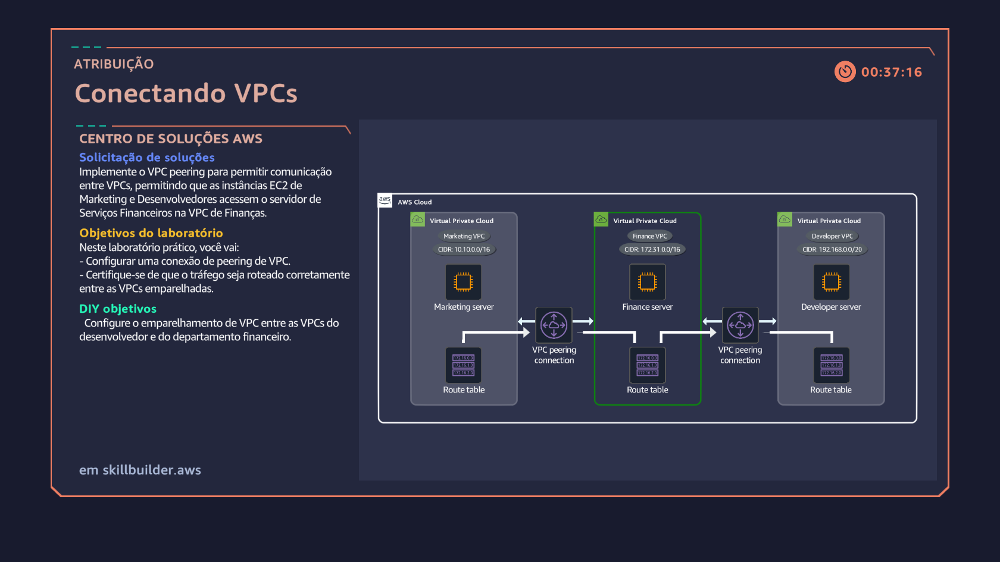 |
| 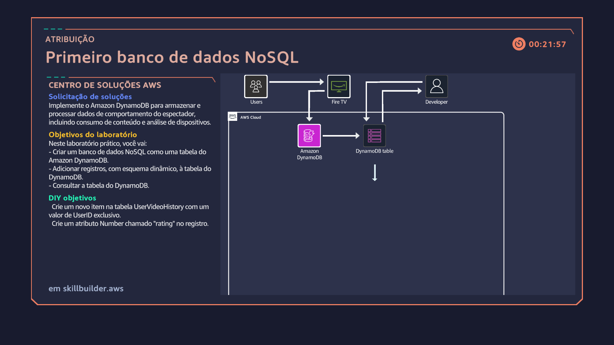 |
| 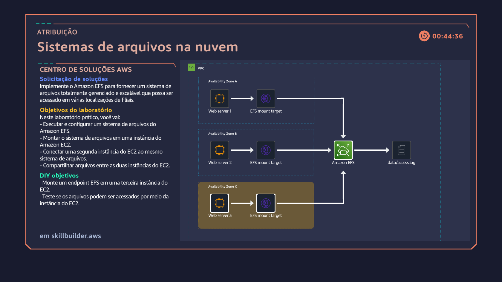 |
| 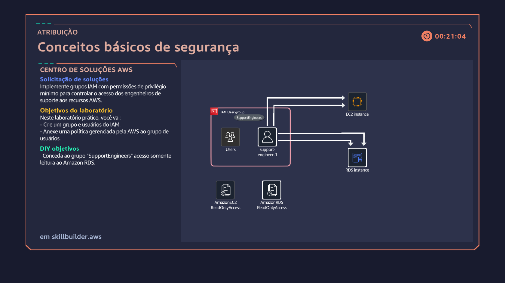 |
| 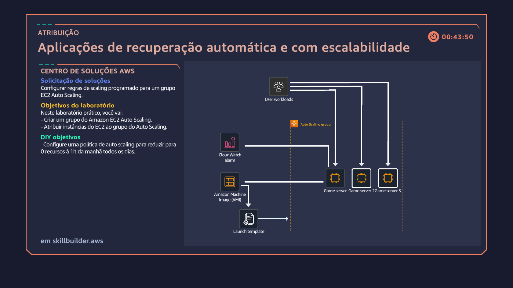 |
| 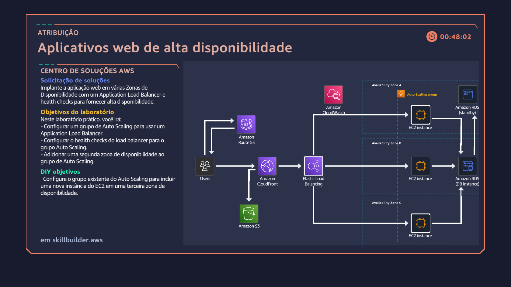 |

> Obs.: As evidências são atualizadas conforme novos cursos e laboratórios AWS são concluídos.

---

## ⚡ Como usar

1. Navegue pela pasta `aws-services`.  
2. Cada serviço possui um `README.md` próprio.  
3. Utilize este repositório como **material de estudo** e **portfólio técnico**.

---

## 📜 Licença

Este projeto está sob a licença **MIT License**.

---

## 🌐 Contato

- GitHub: [EnzoAnthony006](https://github.com/EnzoAnthony006)  
- LinkedIn: [Enzo Anthony](https://www.linkedin.com/in/enzo-anthony/)
